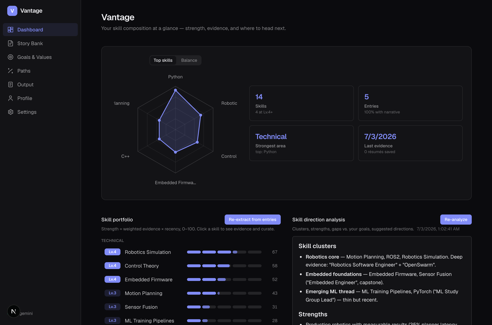
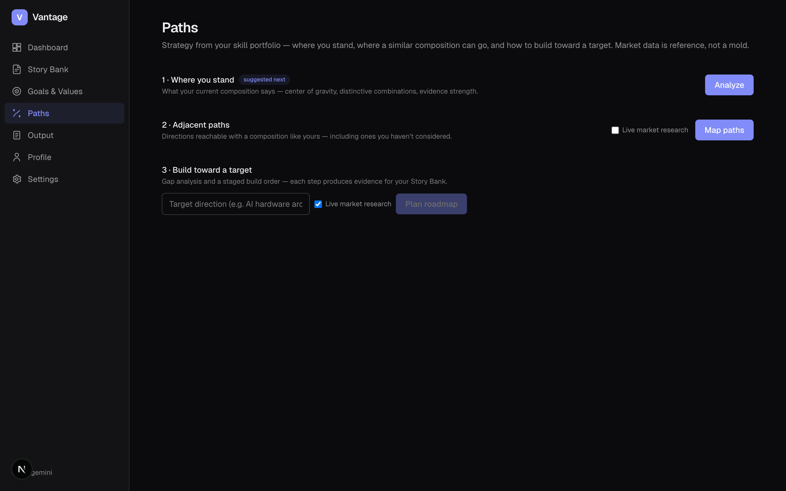
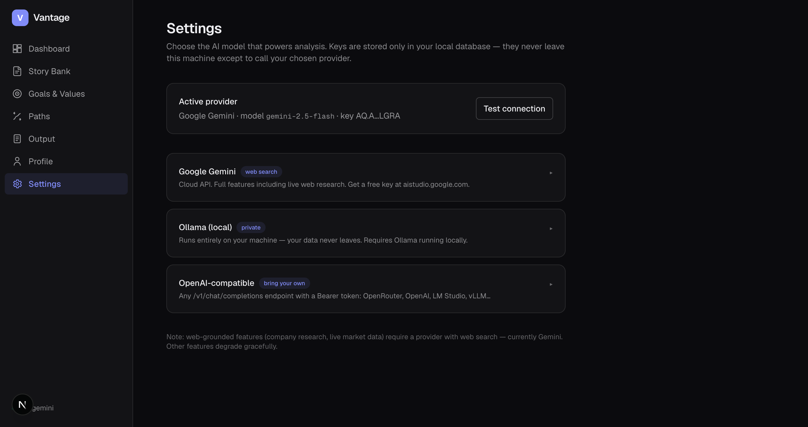

# Vantage

**A skill-and-experience-centric career strategy tool — local-first, open, model-agnostic.**

In a fast-changing job landscape, your most durable asset isn't a job title — it's your unique
**skill portfolio**, evidenced by real experience. Vantage helps you organize that evidence,
see your skill composition clearly, and plan strategy from it. Job applications (tailored résumés,
cover letters) are one *application* of the core; market data (job descriptions) is *reference to
validate direction* — never a mold to squeeze yourself into.



<details>
<summary>More screenshots — Paths (strategy) & Settings (bring your own model)</summary>





</details>

*(Screenshots show a fictional demo profile.)*

## What it does

- **Story Bank** — your evidence library. One entry per experience (work / education / project /
  activity). Dump messy notes or upload an existing résumé; AI structures them — without ever
  upgrading your verbs or inventing facts. *You are the sole authority on what you did.*
- **Skill portfolio (Dashboard)** — AI extracts skills from your evidence with weighted links
  (core / supporting / mentioned). Strength scores (0–100, Lv.1–5) combine evidence weight,
  recency, and duration. Curate freely — rename, merge, recategorize; your edits survive
  re-extraction. Radar chart, evidence timeline, persisted analyses.
- **Goals & Values** — define your ideal life, hard limits, and identity. AI explores with
  questions and possibility analysis; it never prescribes.
- **Paths** — the strategy core. Where does your composition stand? What directions are reachable
  with a similar composition (including ones you haven't considered)? For a chosen target: gap
  analysis (skill gaps vs evidence gaps) and a staged build order where every step produces a new
  piece of evidence.
- **Output** — upload a JD → structured digest → evidence-matched entry selection → tailored
  résumé and cover letter (with optional live company research).

## Quick start

```bash
npm install
npm run db:push        # creates local SQLite (db.sqlite)
npm run dev            # http://localhost:3000
```

Open **Settings** in the app and connect a model. Everything is stored locally (SQLite, gitignored).

## Bring your own model

| Provider | Setup |
| --- | --- |
| **Google Gemini** | Paste an API key from [aistudio.google.com](https://aistudio.google.com). Full features incl. live web research. |
| **Ollama (local)** | Run `ollama serve`, pull a model (`ollama pull llama3.2`). Vantage auto-detects installed models. Fully private. |
| **OpenAI-compatible** | Any `/v1/chat/completions` endpoint with a Bearer token: OpenRouter, OpenAI, LM Studio, vLLM… |

Set the **capability tier** for small local models — Vantage adapts its harness (finer task
splitting, stricter JSON validation and retries) and degrades web-dependent features gracefully.

Dev fallback: `.env.local` with `GEMINI_API_KEY=…` (see `.env.example`).

## Let your agent drive it

If you already run an AI assistant (Claude Code, OpenClaw, …), it can operate Vantage directly —
and do the analysis with **its** model, spending none of your Vantage-side tokens:

1. **MCP server** (recommended): `cd mcp && npm install`, then register with your agent:

```json
{
  "mcpServers": {
    "vantage": {
      "command": "node",
      "args": ["/path/to/vantage/mcp/index.mjs"],
      "env": { "VANTAGE_URL": "http://localhost:3000" }
    }
  }
}
```

12 tools: read entries/skills/goals/JDs, create & update entries, curate skills, fetch assembled
analysis contexts (`get_analysis_context` — system + prompt, no LLM call), and write results back
(`save_analysis`, `save_path_plan`) so they appear in the app, marked agent-sourced.

2. **Plain REST**: every endpoint is documented in [`public/llms.txt`](public/llms.txt). Analysis
endpoints accept `contextOnly: true` to return the assembled prompt instead of calling a model.

Step-by-step agent guide (incl. a ready-made integration test): [`docs/agent-quickstart.md`](docs/agent-quickstart.md).

## Non-negotiable AI constraints

All AI features enforce: preserve verb strength exactly ("helped" never becomes "led"), never
invent outcomes/metrics/ownership, never imply sole ownership of shared work, ask instead of
guessing. These constraints are part of the product, not a style preference.

## Stack

Next.js (App Router) + React + TypeScript + Tailwind. SQLite + Drizzle ORM (Postgres-compatible
schema). Provider-abstracted AI layer (`src/lib/ai/provider/`). No component library, no chart
library — pure SVG visualizations.

## License

MIT
